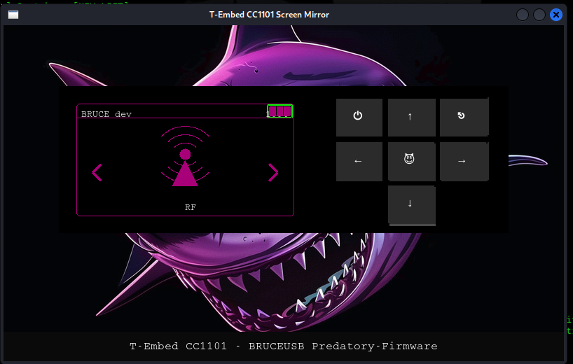
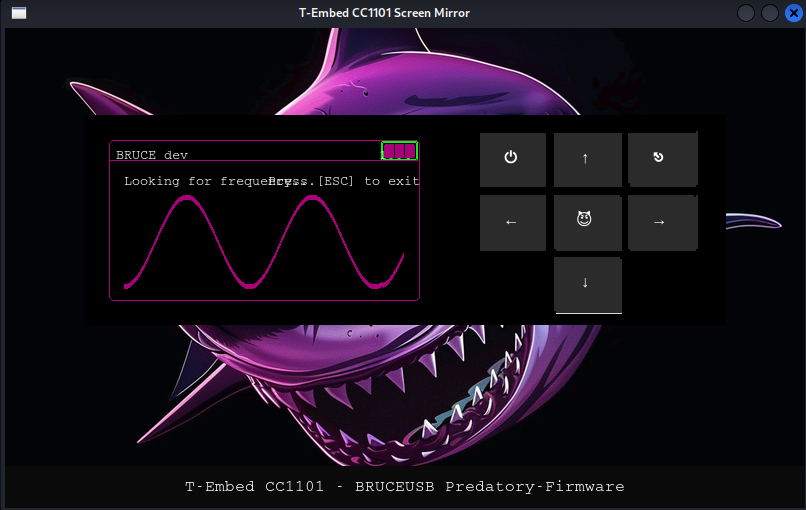

### REQUIREMENTS ##
before running the GUI ensure requirements.txt have been installed using
pip install -r requirements.txt or whatever your system requires.

##If you need a virtual environment follow these instructions##

1. Make sure you have python3-venv installed
sudo apt install python3-venv
2. Create a virtual environment inside your project
From the USBGUI directory:
python3 -m venv .venv
#This creates a .venv/ folder in your project with isolated Python + pip.
3. Activate the virtual environment
source .venv/bin/activate

4. Install requirements

pip install -r requirements.txt

5. Run your GUI script to ensure it works.
Python3 BruceUSB.py

6. Down below is instructions on how to change the serial port to the correct one for whatever your device may be on. This step is crucial in ensuring a connection to your T-embed device.

## The config section in the code should be changed to match
## the correct port your device is on. 
## Either nano or use whatever code editor (Visual Studio, etc) and locate this section in BruceUSB.py--> 
## -->   # === CONFIG ===
## -->   SERIAL_PORT = '/dev/ttyACM0' <-- You want to change only this section.
## -->   BAUD_RATE = 115200
## -->   IMAGE_FOLDER = './images'

#To run this GUI successfully over usb you need to flash your device with the BruceUSB firmware.

#To flash your device.

1. Unplug your device from the host device (laptop, computer. etc) and close the gui if you have the gui running. 

2. cd to the ../Firmwares/BruceUSB directory from inside that directory your going to hold the middle button on your device and plug the device back in while holding the button.

3. Once your device is plugged in and in bootloader mode your going to run the 
command pio run –-target upload and wait for your device to flash “if you installed the requirements.txt as explained earlier this should flash it correctly”.

# After flash

1. unplug your device and reset it with the rst button and plug it back in.

2. cd to the USBGUI directory and run the gui (python3 BruceUSB.py) “if you get an output with the gui saying something like ready to read but nothing is there to read just unplug your device close the gui and plug your device back in and start the gui again.

##IF YOUR DEVICE SUCCESSFULLY FLASHED THE BRUCE FIRMWARE AND YOU FOLLOWED THE STEPS CORRECTLY YOUR GUI SHOULD NOW DISPLAY YOUR T-EMBED CC1101 SCREEN USING USB ANYTIME YOU RESET YOUR DEVICE YOU WILL NEED TO CLOSE THE GUI AND RERUN YOUR GUI##

 
 

## Both cc.py and cc11.py only show serial output being sent over “could be useful for future debugging. If you find yourself running these scripts for any reason any long output of “/////” lines is going to be base64 encoded picture data and other output like drawRect, etc is the redirected output making the gui work.##

##THIS FIRMWARE VERSION IS MEANT TO BE USER FRIENDLY TO THE COMMUNITY OF T-EMBED CC1101 USERS WITH BROKEN SCREENS AND ANYONE WHO JUST WANTS ACCESS TO THEIR DEVICE OVER USB THIS FIRMWARE STILL SUPPORTS THE WEBUI NAVIGATOR AND ALL OTHER BRUCE FUNCTIONALITY BUT IS NOT A FULLY PATCHED VERSION WHEN RUNNING THE GUI SOME SCREEN OUTPUT MIGHT LAYER ESPECIALLY TEXT OUTPUT SUCH AS WIFI SCANS AS WELL AS THE MENU ITEM ICONS NOT DISPLAYING PROPERLY.

the factory_v1.1_20250109.bin is the factory firmware on your device just there for if you want to flash back to factory firmware.

##ORIGINAL FILES FROM https://github.com/pr3y/Bruce.git 

##FILES MODDED/ADDED BY ME TO (BruceUSB Firmware) I DO NOT CLAIM ANY RIGHTS TO THE EDITED BRUCE FIRMWARE I HAVE ONLY MODDED/ADDED THESE FILES BELOW...

1. SerialInputHandler.cpp

2. SerialInputHandler.h

3. tftLogger.cpp

4. tftLogger.h 

5. navflags.h

5. main.cpp

6. serialcmds.cpp

##GUI FILES BY ME

1. BruceUSB.py

2. cc.py

3. cc11.py

##NOTE: THE USBGUI AND BRUCEUSB FIRMWARE SHOULD WORK FOR A TEMPORARY FIX IF YOU HAVE A BROKE T-EMBED CC1101 SCREEN.

